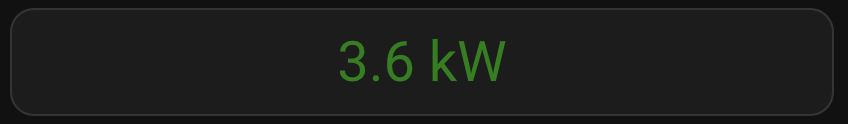

# Smartpeak Power Card

A simple and flexible Home Assistant custom card to visualize your current power usage in real-time. Supports both fixed and dynamic thresholds based on an entity, with color indication.

 <!-- Optional screenshot -->

## Features
- Displays real-time power usage in W or kW
- Color changes based on thresholds:
  - Purple: negative (injection)
  - Green: below threshold
  - Orange: between threshold and threshold + margin
  - Red: above threshold + margin
- Threshold can be a fixed value or come from another entity

## Installation via HACS

1. Go to HACS > Frontend > "+" > "Add custom repository"
2. Use this URL:
   ```
   https://github.com/home-ems/smartpeak-power-card
   ```
   and select **Lovelace** as the category
3. Install the card
4. Add the following resource (if not automatically added):
   ```yaml
   url: /hacsfiles/smartpeak-power-card/smartpeak-power-card.js
   type: module
   ```

## Usage

Add this card to your dashboard:

### With dynamic threshold (from entity)
```yaml
type: custom:smartpeak-power-card
current_power_entity: sensor.current_power
threshold_entity: sensor.quarter_peak
margin: 1
```

### With fixed threshold
```yaml
type: custom:smartpeak-power-card
current_power_entity: sensor.current_power
threshold: 2.5
margin: 1
```

## Configuration Options
| Option                | Required | Description                                                       |
|------------------------|----------|-------------------------------------------------------------------|
| `current_power_entity` | ✅       | Entity ID of the current power usage sensor                      |
| `threshold_entity`     | ❌       | Entity ID that provides the dynamic threshold (in kW)            |
| `threshold`            | ❌       | Fixed threshold value (in kW) if no entity is used               |
| `margin`               | ❌       | Margin added to threshold to calculate orange/red transitions    |

## License
MIT License © 2025 [Smartpeak](https://smartpeak.be)
